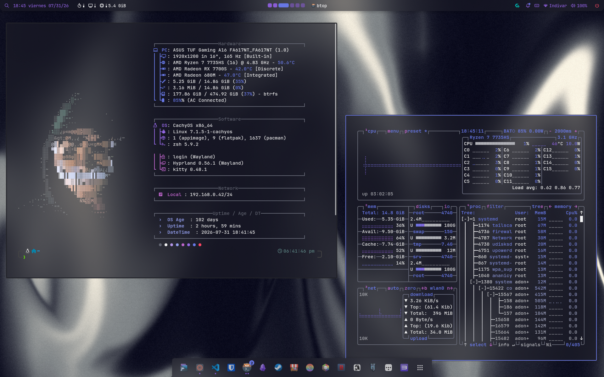

# 🐧 Dotfiles

Personal repository for managing system configurations, automation scripts, and hardware optimizations using **chezmoi**.



## Hardware: Asus TUF Gaming A16 Advantage Edition (FA617NT)

Contains specific configurations to optimize performance and fix known bugs for this model:

- **CPU:** AMD Ryzen 7 7735HS
- **dGPU:** AMD Radeon RX 7700S
- **Display:** 16" @ 165Hz
- **OS:** [CachyOS](https://github.com/CachyOS/linux-cachyos)
- **WM + Shell:** [Hyprland](https://github.com/hyprwm/hyprland) + [Noctalia](https://github.com/noctalia-dev/noctalia)

## Setup

Clone and apply the dotfiles:

```sh
chezmoi init https://github.com/Aristides-19/dotfiles.git
chezmoi apply
```

### Automation & setup scripts (chezmoi `run_once` / `run_onchange`)

These run automatically on `chezmoi apply` when added or modified, or can be run manually from `scripts/`:

| Script                                   | Purpose                                                                                                      |
| ---------------------------------------- | ------------------------------------------------------------------------------------------------------------ |
| `run_once_install.sh`                    | Installs all packages (official + AUR), sets Zsh as default shell, enables `asusd`/`supergfxd` (opinionated) |
| `run_once_noctalia_setup.sh`             | Installs Hyprland + Noctalia + uwsm + XDG portals, deploys `/etc/skel` GTK/cursor configs, enables plugins   |
| `run_once_wifi_fix.sh`                   | Fixes Wi-Fi drops on Realtek RTL8852BE (disables power save in `rtw89` + NetworkManager)                     |
| `run_once_autologin.sh.tmpl`             | Configures agetty autologin on TTY1 for direct boot into Hyprland                                            |
| `run_onchange_setup_plymouth.sh.tmpl`    | Deploys the `tuf-boot` Plymouth theme                                                                        |
| `run_onchange_setup_asus.sh.tmpl`        | Deploys `asusd`/`supergfxd` configs, fan curves, CPU boost tmpfiles, and masks `power-profiles-daemon`        |
| `run_onchange_enable_user_services.sh.tmpl` | Reloads systemd user daemon and enables `fix-audio.service` and `vram-limit.service`                          |

## Repository structure

| Path                                                   | What it configures                                                           |
| ------------------------------------------------------ | ---------------------------------------------------------------------------- |
| `dot_config/hypr/`                                     | Hyprland (modular: binds, autostart, monitors, variables, windowrules...)    |
| `dot_config/noctalia/`                                 | Noctalia shell: bar, dock, control center, theming, idle, session actions    |
| `dot_config/uwsm/`                                     | uwsm session env (`AQ_DRM_DEVICES`, terminal, browser, Qt/GTK/Electron vars) |
| `dot_config/kitty/`                                    | Terminal                                                                     |
| `dot_config/gtk-3.0`, `gtk-4.0`, `qt6ct`, `xsettingsd` | Cross-toolkit theming                                                        |
| `dot_config/btop/`, `dot_config/fastfetch/`            | System monitor + fetch                                                       |
| `dot_config/systemd/user/`                             | User services (`fix-audio.service`, `vram-limit.service`)                    |
| `dot_local/bin/`                                       | Custom user scripts (`recorder`, `fix-audio`, `toggle-cpuboost`, etc.)       |
| `dot_local/share/scripts/`                             | AC / Battery hooks & login sync (60Hz ↔ 165Hz dynamic switching)              |
| `system/`                                              | Root-level configs and templates (`asusd`, `supergfxd`, `tmpfiles.d`)        |

## Keybindings

Main mod is **SUPER**. Full list in `dot_config/hypr/config/binds.lua`.

| Key                           | Action                                             |
| ----------------------------- | -------------------------------------------------- |
| `SUPER + Space`               | Launcher                                           |
| `SUPER + Return`              | Terminal (kitty + zsh)                             |
| `SUPER + W`                   | Browser (zen)                                      |
| `SUPER + E`                   | File manager (nautilus)                            |
| `SUPER + T`                   | Editor                                             |
| `SUPER + Q`                   | Close window                                       |
| `SUPER + D` / `SUPER + F`     | Maximize / Fullscreen                              |
| `SUPER + ALT + Space`         | Toggle float                                       |
| `SUPER + L`                   | Lock screen                                        |
| `SUPER + P`                   | Color picker                                       |
| `SUPER + SHIFT + S` / `Print` | Region / full screenshot                           |
| `SUPER + R`                   | Toggle region recording                            |
| `SUPER + SHIFT + R`           | Toggle fullscreen recording                        |
| `SUPER + ALT + R`             | Toggle recording with desktop audio                |
| `SUPER + V`                   | Clipboard manager                                  |
| `SUPER + X`                   | Control center                                     |
| `SUPER + B`                   | Toggle CPU turbo boost                             |
| `SUPER + 1..6`                | Switch workspace                                   |
| `SUPER + SHIFT + 1..6`        | Move window to workspace                           |
| `SUPER + CONTROL + arrows`    | Workspace / monitor navigation                     |
| `Fn + F6`                     | Region screenshot (firmware → `SUPER + SHIFT + S`) |
| Media/brightness keys         | Volume, mic, playback, brightness                  |

## Hardware & System Optimizations

- **Dynamic Display Output Detection:** Hyprland automatically resolves `eDP-1` (Ultimate/dGPU MUX mode) vs `eDP-2` (Hybrid/iGPU mode) to prevent scaling and workspace mismatches.
- **Dynamic Refresh Rate Switching:** Drops to 60Hz on battery and ramps up to 165Hz on AC power automatically via Noctalia power hooks & login sync script.
- **VRAM Cgroup Buffer (RX 7700S):** `vram-limit.service` sets a 100 MiB safety margin on user app slice VRAM allocation to avoid hard GPU lockups/freezes when running out of VRAM.
- **CPU Boost Control:** `SUPER + B` toggles CPU Turbo Boost on/off on the fly (`/sys/devices/system/cpu/cpufreq/boost`) without sudo prompts via tmpfiles rule.
- **Software Cursor Rendering:** Configured with `no_hardware_cursors = 1` in Hyprland to avoid mouse freeze and artifact issues on AMD dGPU.
- **ASUS Daemons:** Managed via `asusd` and `supergfxd` (`power-profiles-daemon` masked to eliminate EPP/profile race conditions).
- **GPU Activity Monitoring:** `gpu_busy_percent` can report activity while nothing is using the GPU; use `amdgpu_top` for accurate per-process telemetry.

## Dynamic theming

Noctalia generates themes from the current wallpaper and applies them via templates (`dot_config/noctalia/templates/` or built-in/community templates enabled in `dot_config/noctalia/config.toml`).

## Troubleshooting

- **Wi-Fi drops:** Handled via `scripts/run_once_wifi_fix.sh`.
- **Audio levels reset on boot (ALC256):** `dot_config/systemd/user/fix-audio.service` runs `~/.local/bin/fix-audio` after PipeWire/WirePlumber start (user service).
- **Cursor freeze on dGPU:** Hardware cursors disabled in `dot_config/hypr/config/inputs.lua`.
- **Monitor output changes with MUX switch:** Automatically resolved by `get_primary_monitor()` in `dot_config/hypr/config/variables.lua`.
- **DRM card reordering:** Environment resolves GPU by PCI path, so `cardN` changes are handled automatically.
- **Restart Noctalia:** `SUPER + Escape` (or `killall noctalia; nohup noctalia -d &`).

## Maintenance

```sh
chezmoi diff        # review changes
chezmoi apply       # apply changes
chezmoi cd          # enter the source directory
```
